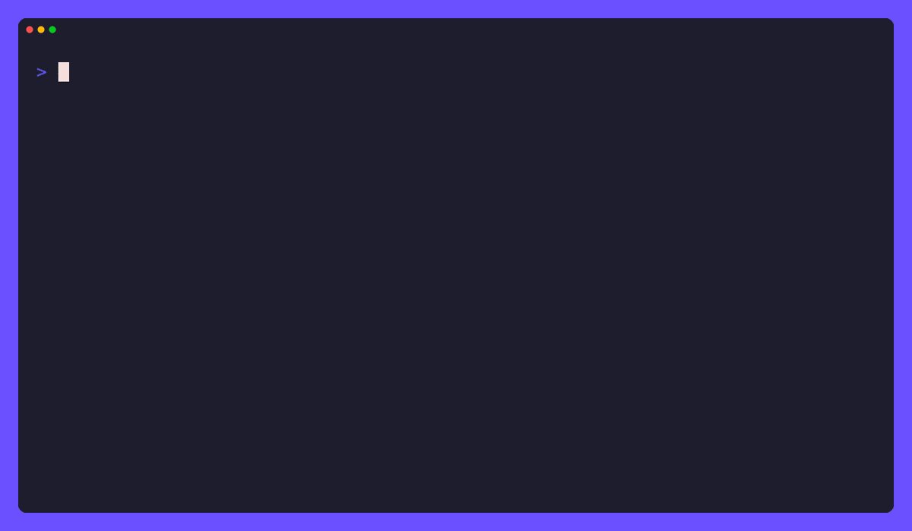

# kura

[](https://github.com/tamnd/kura/actions/workflows/ci.yml)
[](https://github.com/tamnd/kura/releases/latest)
[](https://pkg.go.dev/github.com/tamnd/kura)
[](https://goreportcard.com/report/github.com/tamnd/kura)
[](./LICENSE)

**kura** (蔵, "storehouse") builds offline, browsable archives of YouTube content.

Point it at a video, a channel, a playlist, a search, or a music album and it
writes a self-contained repository on disk: every video as a record, its full
metadata, its transcript, its comments and chapters, every thumbnail and avatar
downloaded locally, and, when you ask for it, the video and audio streams
themselves pulled down in pure Go.
The repository renders into a static HTML site that plays in the browser offline
and into clean Markdown you can read or grep, with the original JSON kept beside
every record as the source of truth.

[Install](#install) • [Quick start](#quick-start) • [Depth model](#the-depth-model) • [Repository layout](#the-repository-on-disk) • [Commands](#commands) • [Configuration](#configuration) • [How it works](#how-it-works)



A 蔵 is the thick-walled Japanese storehouse where a household keeps what it
means to last.
kura takes the fleeting, recommendation-churned, deletable stream of YouTube and
stores it: a vault you fill with channels and videos and open offline any time.

Full documentation lives at [kura.tamnd.com](https://kura.tamnd.com).

## How it works

kura reuses the engine that [ytb-cli](https://github.com/tamnd/ytb-cli) already
built: the no-key InnerTube transport, the renderer-walking parsers, the
normalized `Video`/`Channel`/`Playlist`/`Comment` types, the caption, chapter and
SponsorBlock sidecars, and, most importantly, the pure-Go native download engine
(the token-free `ANDROID_VR` client, the `goja` `nsig` solver, the ranged
concurrent fetcher, the `yt-dlp`-compatible format selector).
It never opens a browser at youtube.com and never fights the SPA: it reads the
same free InnerTube surfaces ytb-cli reads, so it gets structured videos, not a
screenshot of a rendered page.

kura adds only the archive-shaped pieces ytb-cli never needed: a repository on
disk, a media and stream localiser, and the HTML and Markdown renderers.
It is the YouTube sibling of [tori](https://github.com/tamnd/tori) (which archives
X), and it borrows [kage](https://github.com/tamnd/kage)'s inert-self-contained
mirror philosophy and [yomi](https://github.com/tamnd/yomi)'s clean-Markdown
philosophy for what it writes.

## Install

### Go

```bash
go install github.com/tamnd/kura/cmd/kura@latest
```

### Release archives and Linux packages

Every [release](https://github.com/tamnd/kura/releases) attaches `tar.gz`
archives (and a `.zip` for Windows) for Linux, macOS, Windows, and FreeBSD, plus
`.deb`, `.rpm`, and `.apk` packages and a `checksums.txt`.
Download the one for your platform, extract `kura`, and put it on your `PATH`.

```bash
# Debian/Ubuntu
sudo dpkg -i kura_*_linux_amd64.deb

# Fedora/RHEL
sudo rpm -i kura_*_linux_amd64.rpm
```

Homebrew and Scoop manifests publish alongside each release once their taps are
configured.

### Container

The image carries kura and nothing else.
Mount a directory for the output and point the archive at a target:

```bash
docker run --rm -v "$PWD/out:/out" ghcr.io/tamnd/kura archive dQw4w9WgXcQ
```

## Quick start

Capture one video with its metadata, thumbnail, and transcript:

```bash
kura archive dQw4w9WgXcQ
```

Capture it and download the playable stream too:

```bash
kura archive dQw4w9WgXcQ --depth media
```

Capture a whole channel as a catalog, then serve it back offline:

```bash
kura archive @mkbhd
kura serve $HOME/data/kura/youtube/@mkbhd
```

More examples:

```bash
kura archive @mkbhd --depth media -f bv*+ba/b   # full vault: every upload, merged mp4
kura archive @lexfridman --transcripts-only      # a greppable spoken-word corpus
kura archive PLxxxx --depth audio -x             # a playlist as an offline audio archive
kura archive --search "lofi mix" --max 200
kura archive @mkbhd --comments --sponsorblock    # add comment + segment sidecars
kura add @mkbhd                                  # fetch only new uploads, re-render
kura add @mkbhd --depth media                    # upgrade the catalog to a playable vault
kura render ~/data/kura/youtube/@mkbhd --view md # add a Markdown view, no fetch
```

## The depth model

Depth decides whether and how kura saves the bytes of a video.
It is orthogonal to the target: any target can be captured at any depth.

- `--depth meta` (the default) keeps records, thumbnails, transcripts, chapters,
  and, with `--comments`, comments.
  No stream bytes.
  Fast and small: a catalog of a channel you can read, grep, and browse offline.
- `--depth media` keeps everything `meta` keeps plus the video and audio streams,
  fetched by the native engine and format-selectable with `--format`/`-f`.
  Large: the true offline vault that plays every video.
- `--depth audio` keeps records plus the audio stream only, for music, lectures,
  and podcasts where the picture is incidental.

A catalog can be upgraded to a vault later with `kura add --depth media`, which
fetches only the streams for videos whose records are already on disk.

## The repository on disk

A capture writes one self-contained directory under `<out>/youtube/<root>/`,
where `<root>` is the canonical, case-stable target identity: a channel keeps its
`@handle`, while a video, playlist, and search are prefixed by kind and lowercased
(`video-dqw4w9wgxcq`, `playlist-plxxxx`, `search-lofi-mix`).
Every internal reference is a relative path, so the folder is movable and opens
with the network unplugged.

```
kura-out/youtube/@mkbhd/
├── manifest.json            the index: target, depth, counts, range, capture stamps
├── index.html               the repo home, inert
├── README.md                the repo home as Markdown
├── channel.json             the captured Channel record
├── videos/
│   ├── <vid>.json           canonical youtube.Video JSON, one per video
│   ├── <vid>.raw.json       the untouched upstream payload
│   ├── <vid>.comments.json  captured comments (when --comments)
│   ├── <vid>.transcript.<lang>.vtt
│   ├── <vid>.transcript.<lang>.txt   the flat transcript, grep-friendly
│   ├── <vid>.chapters.json
│   └── <vid>.sponsorblock.json       (when --sponsorblock)
├── html/<vid>.html          per-video watch page, inert
├── md/<vid>.md              per-video Markdown
├── playlists/<plid>.json
├── community/<postid>.json  (when --community)
├── media/
│   ├── thumb/   <vid>__<h6>.jpg
│   ├── avatar/  @mkbhd__<h6>.jpg
│   ├── banner/  @mkbhd__<h6>.jpg
│   ├── video/   <vid>__<fmt>.mp4    (only at --depth media)
│   └── audio/   <vid>__<fmt>.m4a    (--depth audio, or -x)
├── _assets/kura.css         embedded CSS, no remote fonts, no JS
└── state.json               capture cursors + download resume + visited state
```

JSON is the source of truth.
The HTML and Markdown are renderings of it, regenerable at any time with `kura
render` and no re-fetch.

## Commands

| Command | What it does |
|---------|--------------|
| `kura archive <target>...` | Capture a target into a repo under `<out>/youtube/<root>/` |
| `kura add <target>...` | Incremental capture into an existing repo (alias: `update`) |
| `kura render <repo>` | Re-render HTML/MD views from stored JSON, no network |
| `kura serve <repo>` | Serve a repo over http://localhost for preview and playback |
| `kura info <repo>` | Manifest summary: counts, depth, date range, size, gaps |
| `kura completion <shell>` | Shell completion |

`kura --version` prints the build version, commit, and date.

## Key flags

Capture-shaping flags live on `archive` and `add`:

- `--depth meta|media|audio` (default `meta`): whether and how to localise streams.
- `--search <q>` / `--album <id>` / `--transcripts-only`: select a non-default target kind.
- `--shorts`, `--streams`, `--playlists`, `--community`: widen a channel capture.
- `--comments` (with `--max-comments`, `--sort top|new`), `--sponsorblock`: sidecars.
- `--lang <codes>`: transcript language(s) to store.
- `--since`, `--until`, `--since-id`, `--max N`: bound and budget a timeline.

Streams, delegated to the native engine:

- `-f, --format <selector>`: `yt-dlp`-grammar format selection (default `bv*+ba/b`
  with ffmpeg, else `b`).
- `-x, --audio-only`; `--quality <height>` cap; `--ffmpeg-bin`; `--tool yt-dlp`;
  `--concurrent N`.

Rendering and output:

- `--view html|md|html,md` (default `html`): which shapes to render; JSON always written.
- `-o, --out`: output root (default `$KURA_OUT` or `$HOME/data/kura`).
- `--date <RFC3339>`: fix the capture stamp for reproducible output.

Run `kura <command> --help` for the canonical list.

## Configuration

Resolution order, later wins: built-in defaults, then the config file, then
environment, then flags.

```
KURA_OUT          default output root (overridden by --out; else $HOME/data/kura)
KURA_DEPTH        default --depth (meta | media | audio)
KURA_VIEW         default --view (html | md | html,md)
KURA_NO_CACHE=1   bypass the shared cache
```

kura also honours ytb-cli's tool configuration, so a setup that works for `ytb`
works for `kura` unchanged:

```
YTB_YT_DLP_BIN    path to a yt-dlp binary for the optional --tool yt-dlp delegation
YTB_FFMPEG_BIN    path to ffmpeg for the optional A/V merge (else PATH; else muxed-only)
NO_COLOR          honoured by the styles
```

There is no developer-API credential anywhere: kura reads the free InnerTube
surface only.
ffmpeg, when used, is an optional external binary that is never linked, so the
shipped binary stays `CGO_ENABLED=0`.

## Honesty about IP-gated surfaces

Two YouTube surfaces are gated not by auth but by the egress IP: from a flagged IP
YouTube hides comments and serves an empty transcript body.
kura detects the gap, records it honestly in the manifest, falls back to the
optional `yt-dlp` path for transcript text when present, and exits with the
documented code rather than writing a half-empty archive and calling it done.

## License

kura is MIT, inherited from the MIT `ytb-cli` engine it links.
See [LICENSE](LICENSE) and [NOTICE](NOTICE).
This is the one principled difference from its sibling tori, which is AGPL-3.0
because its engine derives from Nitter.
